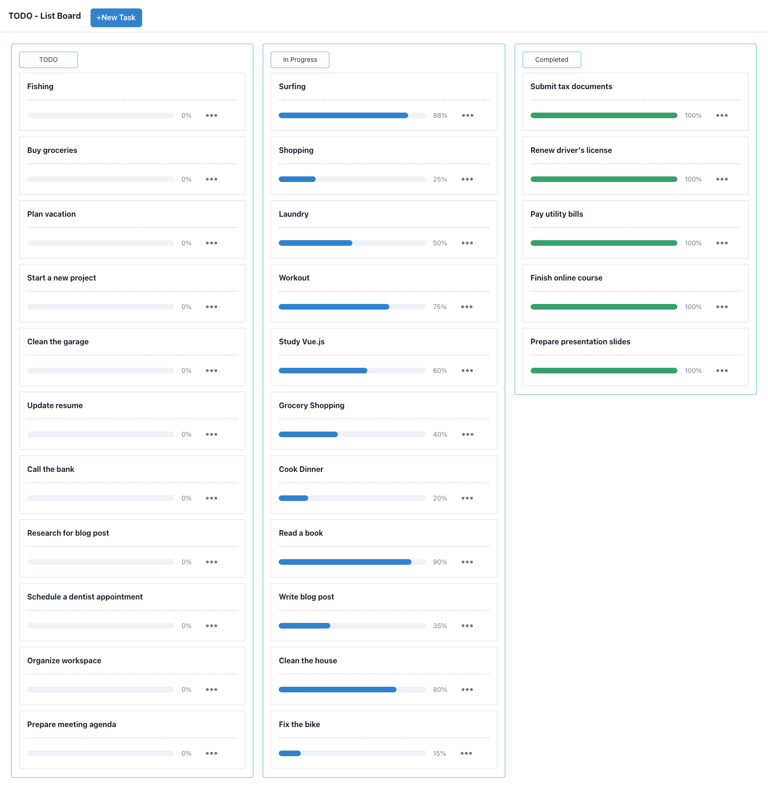

# Mini Project Todo List

This is a mini project for a Todo List application built with React and Vite. It features:

1. CRUD task item management
2. Responsive design

## Screenshots

## Installation

1. Clone the repository.
2. Run `npm install` to install dependencies.
3. Run `npm run dev` to start the development server.

## Usage

- Add new tasks
- Edit existing tasks
- Delete tasks
- Mark tasks as completed

## License

This project is licensed under the MIT License.
